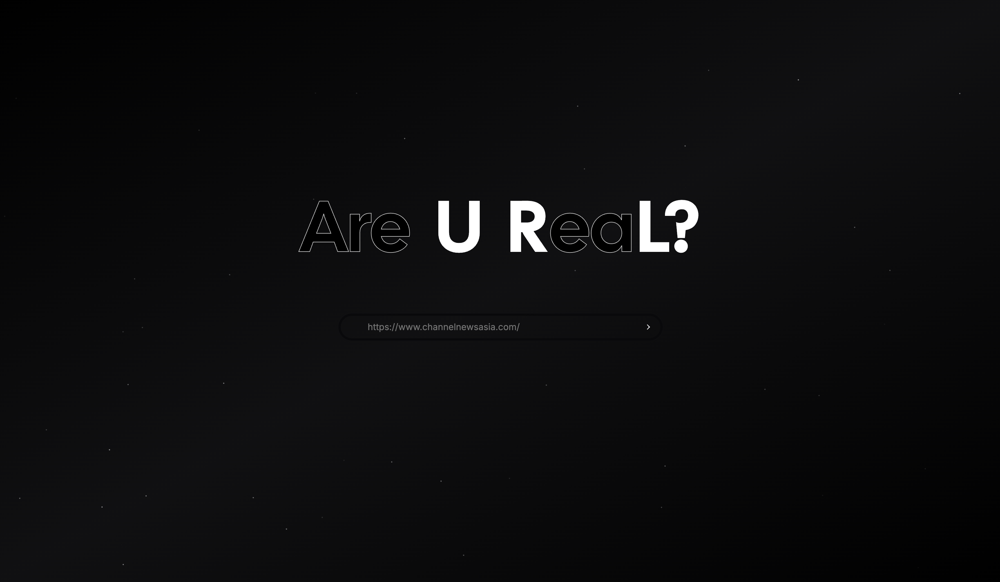
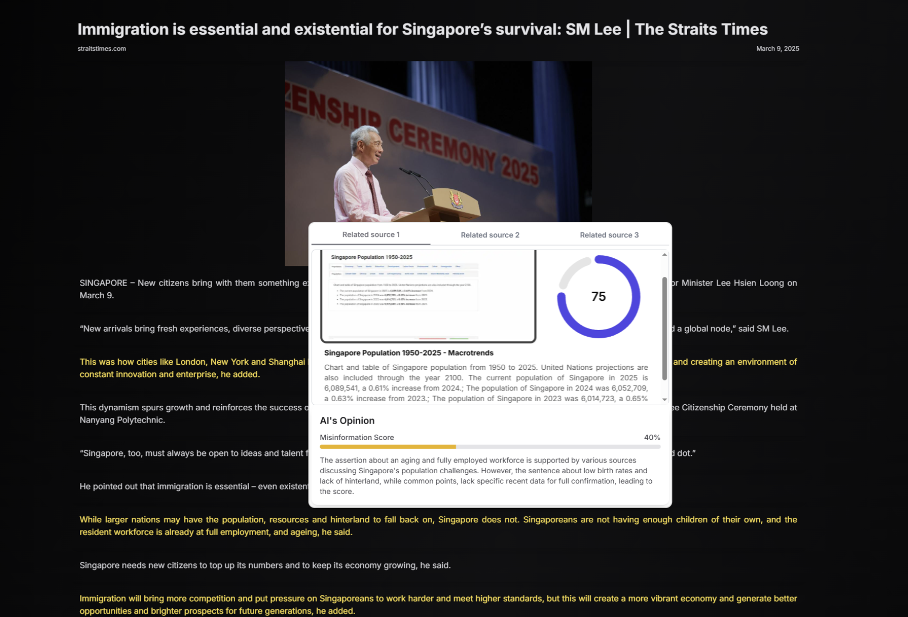

# Tech Fest 2025 - Team 45

# Are U ReaL? <br/> _"Smart Fact-Checking Made Simple.Verify Truth in One Click."_ <br/>

---

<div>
  
  
  
  
  
  
  
  
  
</div>


<p align="center">
  
  
</p>


### Team Members of BluTech:

- [Oscar Qian](https://github.com/oscarqjh)
- [Iain Roderick Tay](https://github.com/eeyearn)
- [Lee Cheng Yao](https://github.com/chengyaolee)
- [Justin Wong](https://github.com/JustinWong645)

### Website Link: [Are U ReaL?](https://techfest2025-red.vercel.app/)

### Video Demo Link: [Watch Demo](https://www.youtube.com/watch?v=BLNftmX8gnA)

---

## Inspiration

With the rapid rise of fake news and misinformation on the internet, distinguishing between legitimate and fraudulent websites has become increasingly difficult. Many users unknowingly fall victim to websites that mislead them with biased or fabricated content. This inspired us to create **Are U ReaL?**, a tool that helps users assess the authenticity of websites and provides them with a reliable answer.

## What it does

**Are U ReaL?** helps users identify fake news websites by scanning URLs and evaluating their content using artificial intelligence. Users can input suspicious website URLs, and the platform analyzes the site’s content, checks for image or text forgery, cross-references with credible sources, and assesses its credibility. The result is an easy-to-understand verdict on whether the website is trustworthy or potentially harmful.

## How we built it

**Are U ReaL?** was built with a strong emphasis on automation and artificial intelligence, with the goal of simplifying website authenticity checks.

- **Agents:** The platform leverages multiple AI agents, such as Web Parser, Image Forgery Expert, News Analyst, Web Researcher, Misinformation Expert, and Blacklist Checker, to perform different tasks and evaluate website content in depth.

We used **CrewAI** to manage multiple agents in an automated pipeline, streamlining the process of evaluating websites.

## Challenges we ran into

- Building a seamless workflow between multiple agents to ensure accurate results.
- Integrating reliable sources for cross-referencing, ensuring that the tool identifies fake news while minimizing false positives.
- Balancing the need for a user-friendly interface with the complexity of AI-driven analysis.

## Accomplishments that we're proud of

- **Reliable Fake News Detection:** Successfully created a platform that provides users with a trustworthy assessment of website authenticity.
- **AI-Powered System:** Integrated multiple AI agents to automate the process of verifying web content.
- **Cross-Source Verification:** Leveraged cross-referencing tools like DuckDuckGo to validate the credibility of news stories.

## What we learned

- Gained insights into AI-powered web scraping and content analysis.
- Improved our understanding of misinformation detection and how AI can be leveraged for fact-checking.
- Developed a more user-friendly approach to web security and content validation.

## What's next for Are U ReaL?

- **Enhancements:** Continuous updates to improve the accuracy of the AI and extend the database of credible sources.
- **Expansion:** Add new features like user reports to help improve fake news detection and crowdsourced verification.

## Steps to launch Are U ReaL locally

### Frontend
Our frontend runs on Next.js

Firstly, enter the directoy of `webapp`
```sh
cd webapp
```

Then, run the following commands to deploy it locally
```sh
pnpm i

pnpm dev
```

### Backend
Our backend runs on FastAPI

Firstly, enter the directory of `server`
```sh
cd server
```

Then, run the build file to install dependencies and host the server
```sh
chmod +x build.sh && ./build.sh
```

---

## NTU Techfest 2025

This project was submitted to the annual NTU Techfest hackathon, and we are excited to showcase our efforts in addressing the challenge of fake news on the web.   
[Find the Submission here!](https://devpost.com/software/are-u-real)

